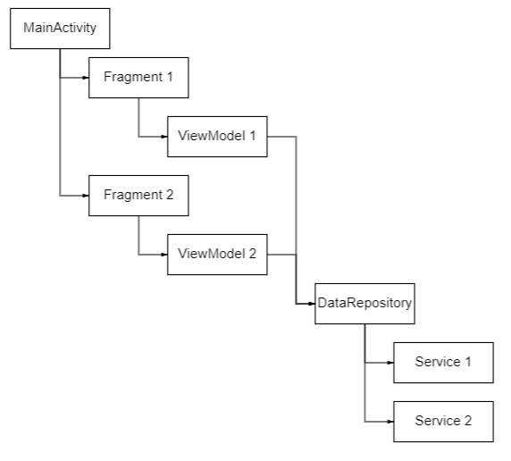

# ERBSStats
This is an Android application that shows the statistics of the  game [Eternal Return Black Survival](https://playeternalreturn.com/ "game"). 

### Functions

- Top players
- Player statistics
- Description of characters
- Search for players and characters
- History of the last 5 actions (character, player, search)

     ")

### Architecture

MVVM, Single-Activity

         
### Instruments
- Kotlin - preferred language for Android development  
- Kotlin сoroutines - asynchronous code  
- ViewModel - storing and managing fragment data  
- Google Navigation Component - navigation between fragments  
- Glide - loading images  
- ViewBinding - replacement for findViewById  
- Retrofit2  - API requests  
- GSON - working with json files  
- LiveData - the interaction of the fragment and the viewModel  
- ROOM - storage of frequently used data, cache of links to images  
- Google-drive - is the first option for storing app data  
- Firebase-storage - second option for storing application data  
- RecyclerView - display dynamic lists
- Dagger2 - implementation of dependencies injection

     
   

